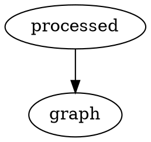

# chapter 2

and here is another pic:

>test fdaasdf dsf asdf sadf sadf sad fsad fsad fsad fasdf dsafdsf sadf sadf sdaf 
adsfasdfdsaf  dsaf sdaf sadf dsf dsaf s fasf sdf sdf ds fsadf sadf sdf  
dsafsadf dsaf dsaf sadf sda fsd f sadf dsaf ds f dsaf
adfasdfsdf dasfsdfsdf

sdfdfsdf 
sdfsdf

hello again.

